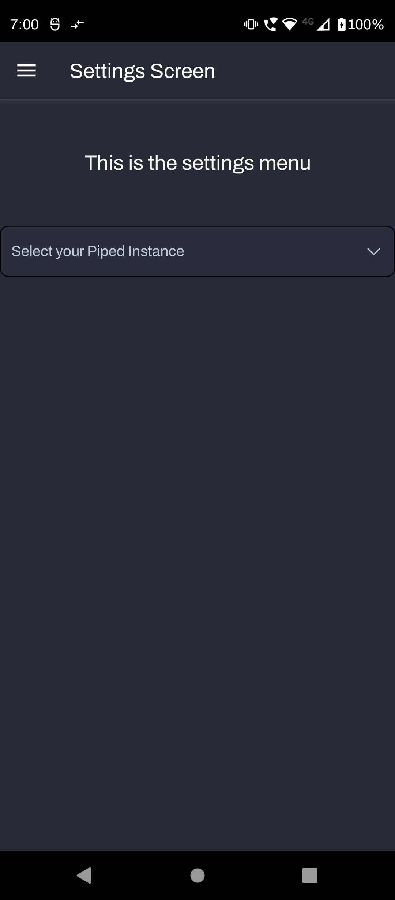
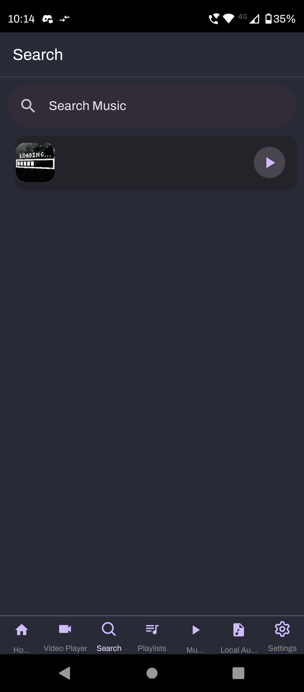
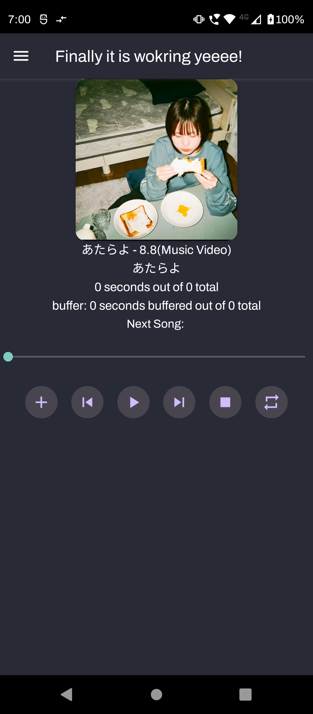

# Soundify


[](https://star-history.com/#SakuraBlossomTree/Soundify&Date)

## Description

Soundify is a (Not Yet) Open Source Spotify Client, it uses Piped and JioSaavan API to get audio sources

I started this project because of latest Spotify Premium changes which take away most of the essential features  

I am trying to learn about React Native as much as possible while making the app

## Table of Contents

- [Installation](#installation)
- [Usage](#usage)
- [Credits](#credits)
- [License](#license)

## Installation

#### Simple Installation Guide

1. Go to the Releases Tab

2. Download the desired version

3. Install the APK

## Usage

#### How to use the app

To add a screenshot, create an `assets/images` folder in your repository and upload your screenshot to it. Then, using the relative filepath, add it to your README using the following syntax:

    ```md
    
    ```

1. Go to the Settings Tab and choose a Piped Instance or JioSaavan and press on Set Instance , if you want to get started I recommand using JioSaavan because Piped servers are unstable



2. Go to Search and Type your Song, if it doesn't come up try this format [song-name] [artist-name] and then hit the play icon.



3. This will then navigate you to the Music Player where you can press the Plus Icon and then Play the Song.

 

## Credits

#### These are the libraries which saved my life. 

[react-native-async-storage](https://github.com/react-native-async-storage/async-storage.git) - An asynchronous, persistent, key-value storage system for React Native. Plan to use for download media(Not Implmented)

[react-native-community/slider](https://github.com/callstack/react-native-slider.git) - React Native component exposing Slider from IOS and SeekBar from Android. Using it to show progress of the song.

[react-navigation/bottom-tabs](https://reactnavigation.org/docs/bottom-tab-navigator/)- A simple tab on the bottom of the screen that lets you switch between different routes. Using it to navigate to screens 

[react-navigation](https://github.com/react-navigation/react-navigation.git) - Routing and navigation for your React Native apps. Using this as the main navigator for the screens.

[react](https://github.com/facebook/react.git) - The library for web and native user interfaces. This is required for React Native to work.

[react-native](https://github.com/facebook/react-native.git) - A framework for building native applications using React. Using it to develop the app.

[react-native-dropdown-picker](https://github.com/hossein-zare/react-native-dropdown-picker.git) - A single / multiple categorizable, customizable, localizable and searchable item picker (drop-down) component for react native which supports both Android & IOS. Using this to switch between Instances and APIs.

[react-native-gesture-handler](https://github.com/software-mansion/react-native-gesture-handler.git) - Declarative API exposing platform native touch and gesture system to React Native. Using it to handle gesture controls and is a dependency for React Navigation.

[react-native-paper](https://github.com/callstack/react-native-paper.git) - Material Design for React Native (Android & IOS). Using this to make the UI look better.

[react-native-reanimated](https://github.com/software-mansion/react-native-reanimated.git) - React Native's Aniamted library reimplemented. Using this for some animations.

[react-native-safe-area-context](https://github.com/th3rdwave/react-native-safe-area-context.git) - A flexible way to handle safe area insets in JS. Also works on Android and Web! Using it as an dependency for react-native-reanimated.

[react-native-screens](https://github.com/software-mansion/react-native-screens.git) - Native navigation primitives for your React Native App. Using this as an dependency for React Navigation.

[react-native-track-player](https://github.com/doublesymmetry/react-native-track-player.git) - A fully fledged audio module created for music apps, Provides audio playback, external media controls, background mode and more!. Using this as the player.

[react-native-vector-icons](https://github.com/oblador/react-native-vector-icons.git) - Customizable Icons for React Native with support for iamge source and full styling. Using this for the icons in the app.

[react-native-webview](https://github.com/react-native-webview/react-native-webview.git) - React Native Cross-Platform WebView. Using this for the old audio player which uses webview to get the piped website

## License

MIT License

Copyright (c) 2023 Yohib Hussain

Permission is hereby granted, free of charge, to any person obtaining a copy
of this software and associated documentation files (the "Software"), to deal
in the Software without restriction, including without limitation the rights
to use, copy, modify, merge, publish, distribute, sublicense, and/or sell
copies of the Software, and to permit persons to whom the Software is
furnished to do so, subject to the following conditions:

The above copyright notice and this permission notice shall be included in all
copies or substantial portions of the Software.

THE SOFTWARE IS PROVIDED "AS IS", WITHOUT WARRANTY OF ANY KIND, EXPRESS OR
IMPLIED, INCLUDING BUT NOT LIMITED TO THE WARRANTIES OF MERCHANTABILITY,
FITNESS FOR A PARTICULAR PURPOSE AND NONINFRINGEMENT. IN NO EVENT SHALL THE
AUTHORS OR COPYRIGHT HOLDERS BE LIABLE FOR ANY CLAIM, DAMAGES OR OTHER
LIABILITY, WHETHER IN AN ACTION OF CONTRACT, TORT OR OTHERWISE, ARISING FROM,
OUT OF OR IN CONNECTION WITH THE SOFTWARE OR THE USE OR OTHER DEALINGS IN THE
SOFTWARE.

---
