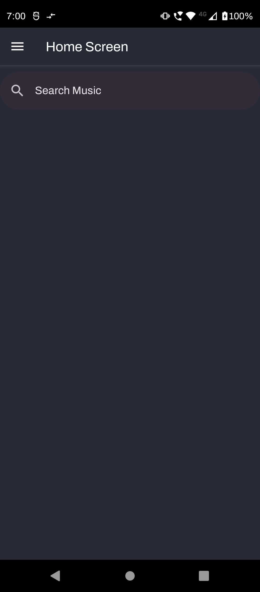
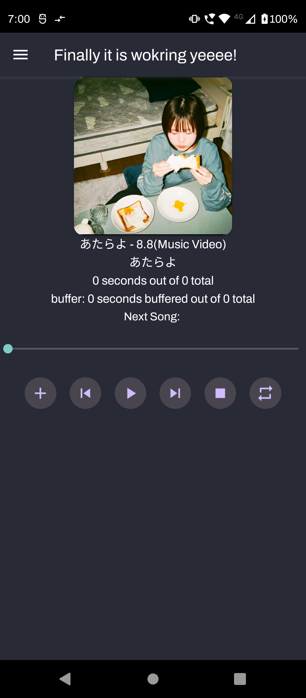
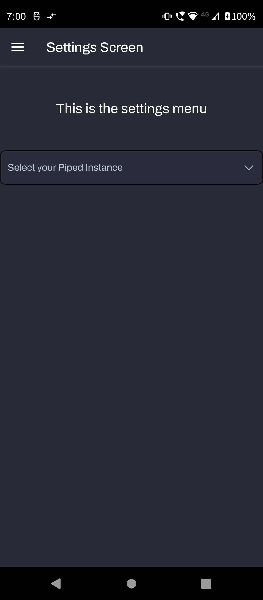

# Soundify

An Open Source Spotify Client made in React Native which utilises Piped API to get audio source for the music

#### This App is still in the making and is not yet finished if you experience any bugs or such please let me know by opening a issue

#### The list of bugs will be in the bugs section

<!--  -->

### Development Board

The link to the Trello board is below

<a href="https://trello.com/b/2GlErXdD/soundify-progress-tracker">Trello board</a>

### Installation guide

#### Android

1. Go to the Releases page and download the .apk for the app
2. Downlaod the APK file 
3. And it should come up as the name soundify

#### Developer

I am SakuraBlossomTree the sole developer of this project 

#### Bugs

1. The Shit Local Audio Player doesn't work

2. And you have to search the song and press the button it will automatically take you to the Audio Player if you maunally go to the audio player then the app will crash

3. If your song doesn't come up then Search like this "Song Name Artist Name"

4. You have to Add your track before playing it

#### Updates

#### You can check the Trello Board for new updates and bugs
